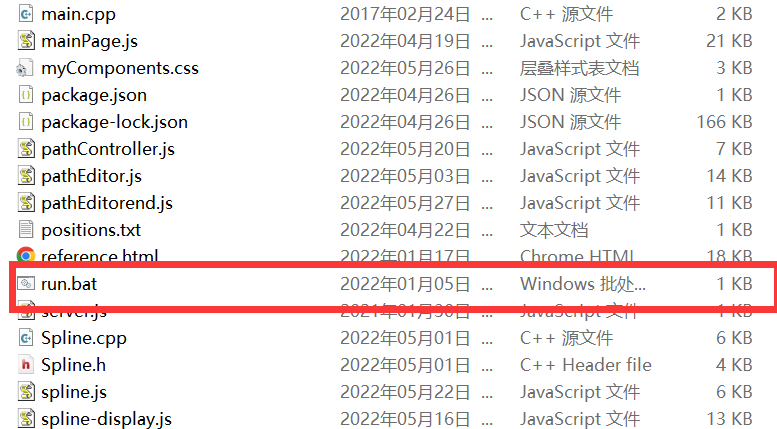
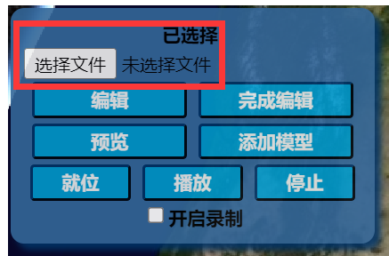
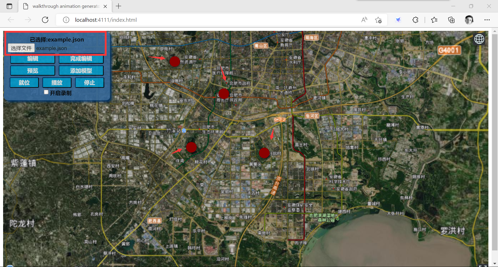
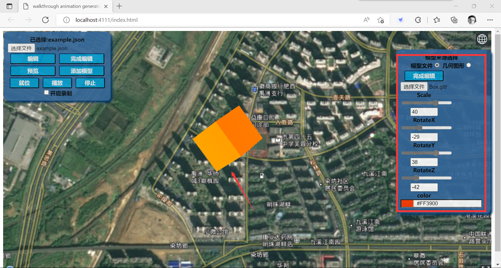
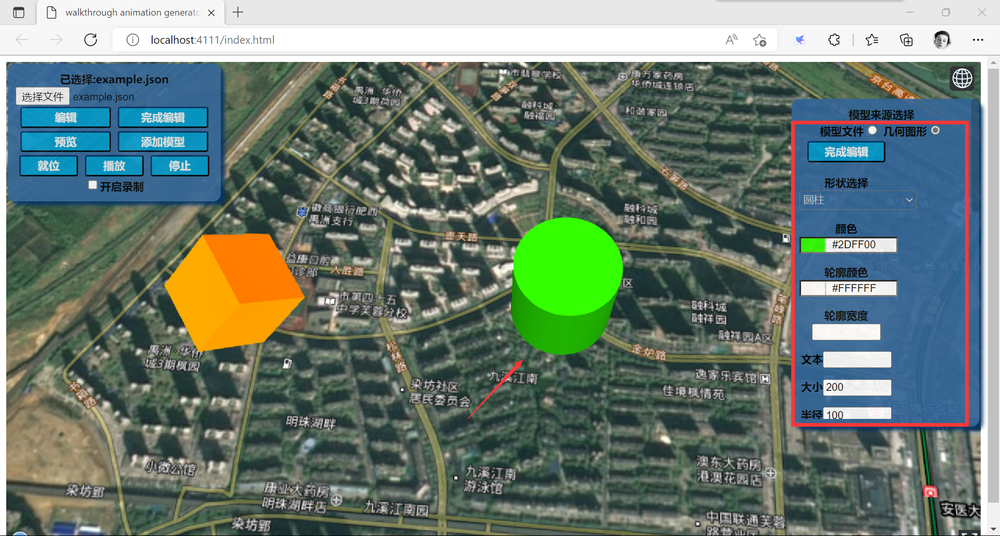
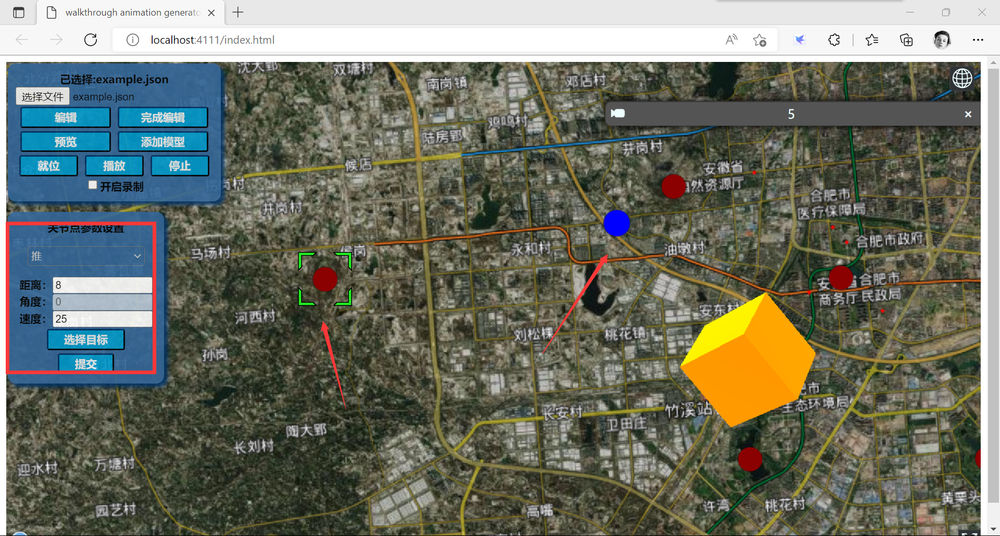
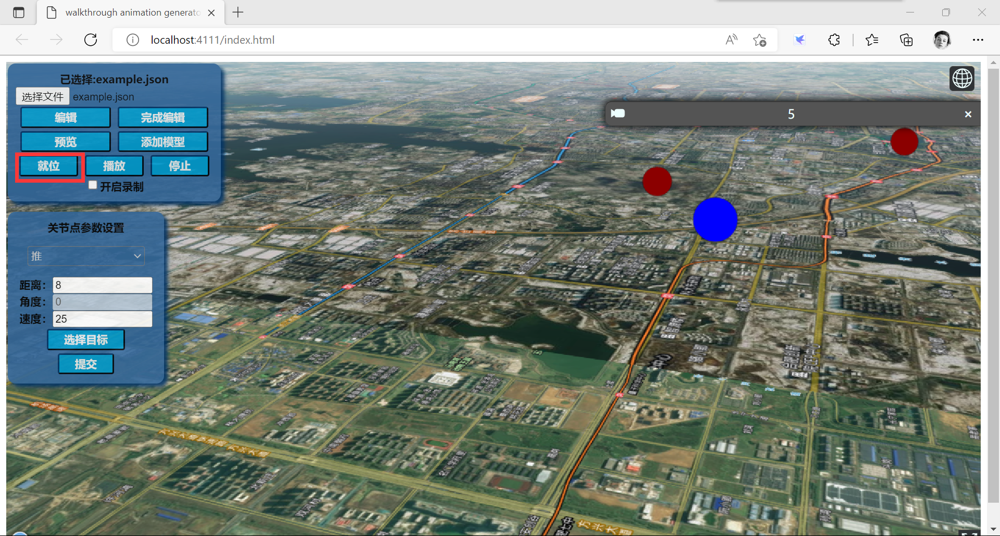
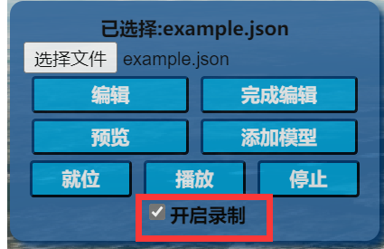
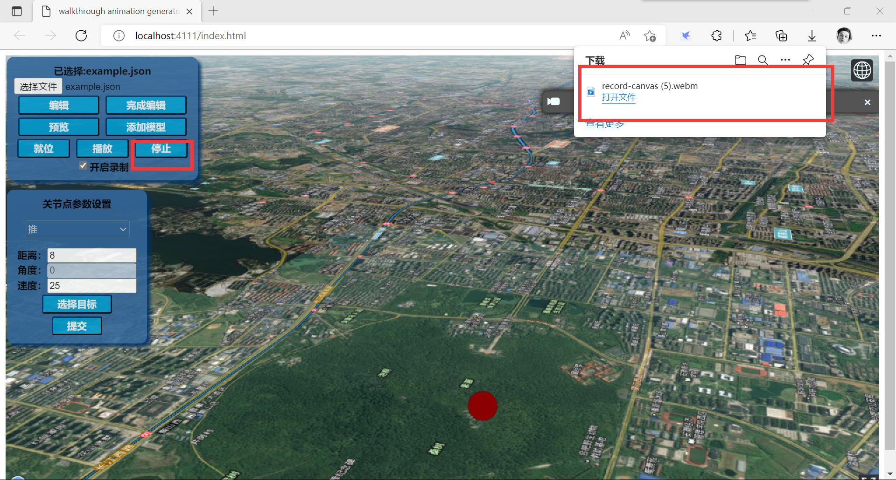

# 开发环境
## 操作系统
windows 10
## 处理器
Intel(R) Core(TM) i5-8250U CPU @ 1.60GHz   1.80 GHz
## 机带RAM
8.00 GB (7.90 GB 可用)
## 编辑器
VSCode
## vc插件
ESLint
glsl-canvas
GLSL Lint
glTF Tools
Vetur
Shader languages support for VS Code
## 框架
Cesium
node-js
jquery
jscolor
knockout
# 文件说明
## 工程文件夹
包含了程序代码和运行所需的框架和依赖
## 数据文件夹
提供了可用于编辑的示例数据，该部分内容非必要，可由使用者自行选择
# 使用指南
1. 确保需要的数据文件在"/data"文件夹中，"/data"在工程文件目录下。
2. 在工程文件夹中找到"run.bat"文件，双击运行程序。

3. 可以单击选择文件按钮并选择格式正确的位置标记文件（见数据文件夹中的"positions.json"或"example.json"）

4. 单击添加模型按钮进入模型编辑模式，该模式下默认为添加gltf格式模型。单击选择文件按钮并选择"*.gltf"或"*.glb"可以选择模型来源，鼠标左键单击则在点击位置生成模型。可拖动滑动条调整模型属性。

5. 单击几何图形选框可切换至几何图形编辑模式。选择需要添加的模型类型并设置参数，单击选择位置按钮之后鼠标左键单击以确定位置。

6. 可以单击编辑按钮进入路径编辑模式，该模式下鼠标左键单击可创建新的位置标记点。
单击已有的标记点可编辑和提交标记点对应位置的相机参数。单击节点参数框的选择目标按钮，鼠标右键单击可选取已选择节点的目标位置，左键单击退出选择。

7. 单击就位按钮，软件计算插值并按首个镜头节点的参数值设置镜头位置和方向。

8. 勾选开启录制选框并单击播放按钮，开始在设定的路径上循环播放动画。

9. 单击停止按钮，动画停止，并生成webm格式视频存储在本地。
